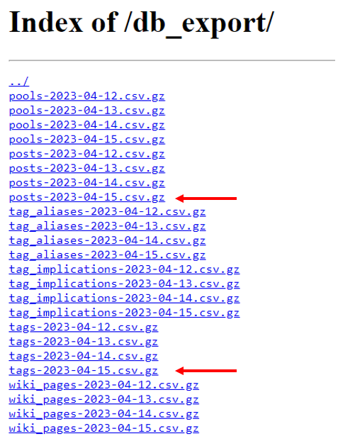

# e621 Posts Downloader


Check out the webui https://github.com/x-CK-x/Dataset-Curation-Tool

##### If you want to see post previews I recommend using Grabber https://github.com/Bionus/imgbrd-grabber <br /> Or simply search in the e621 website

## Features

- Highly customizable settings
- Tag files processing
- Image resizing by minimum shortest side
- Blazingly fast, simple, and straightforward to use
- No rate limiting

## Requirements
python 3.8+

clone repository
```
git clone https://github.com/pikaflufftuft/pikaft-e621-posts-downloader.git
```
```
cd pikaft-e621-posts-downloader
pip install -r requirements.txt
```

#### aria2
This downloader uses aria2 for fast downloading.
```
sudo apt-get install aria2
```
For Windows, install the aria2 build https://github.com/aria2/aria2/releases/ Add aria2 in your environment variable paths

## How to use

#### Customizing Posts Download Batches
Edit the setting parameters in `settings.json` in a text editor.
To create different parameter settings for multiple batches, use `[]` and separate each value with commas.

Example: The following will download posts that have the female tag with a minimum score of 100 in the first batch and posts that have the male tag with a min_score of 200 in the second batch.
```
"required_tags": ["female","male"],
"min_score": [100,200],
```

Not using `[]` will make the parameter setting be used for all batches, e.g., `"required_tags": "female",` will be used for each batch.

For all parameters that use `[]`, they should use the same number of items, e.g.,

`"min_score": [100,200],` along with `"min_date": ["2016","2017","2018"],` will throw an error.

### Executing
| Flag | Argument | Description | Default |
| --- | --- | --- | --- |
| `-f` | `--basefolder` | default output directory used for storing e621 db files and downloading posts | *script's directory* |
| `-s` | `--settings` | (required) path to custom download settings json |  |
| `-c` | `--numcpu` | number of cpu to use for image resizing, set to -1 for max | -1 |
| `-ppb` | `--phaseperbatch` | performing all phases per batch as opposed to completing all batches per phase, e.g., if passed, complete all phases for the current batch before proceeding to the next batch, else, complete posts collection phase before downloading | *not passed* |
| `-pcsv` | `--postscsv` | path to e621 posts csv |  |
| `-tcsv` | `--tagscsv` | path to e621 tags csv |  |
| `-ppar` | `--postsparquet` | path to e621 posts parquet |  |
| `-tpar` | `--tagsparquet` | path to e621 tags parquet |  |
| `-k` | `--keepdb` | pass this argument to keep the db .csv and .csv.gz files after acquiring the parquet files | *not passed* |
| `-ap` | `--aria2cpath` | path to aria2c program |  |
| `-ch` | `--cachepostsdb` | cache e621 posts file when working with multiple batches |  |

Examples:

```
python3 e621_batch_downloader.py -f myfolder -s settings.json
```
```
python3 e621_batch_downloader.py -s settings.json --phaseperbatch
```
I recommend passing `--phaseperbatch` for small storage spaces as thousands of posts can take up a lot of space. This completes batches one by one, resizing images in the current batch before downloading the next batch.

I recommend **not** passing it if you have adequate storage space and memory.

Posts/Tags parquets will be checked first then, when not found, will be created using posts/tags CSVs. <br />
Posts/Tags CSVs when not found, will be created using posts/tags CSV.gz's. <br />
Posts/Tags CSV.gz's when not found, will be downloaded. <br />
Posts/Tags CSVs and CSV.gz's are automatically deleted once the Posts/Tags parquet files are created. Pass the `--keep` to not delete them.

The downloader automatically downloads the latest e621 posts/tags db when you don't have them saved. Pass the `--postsparquet` and `--tagsparquet` arguments along with the paths to the saved posts/tags parquet files to disable it from downloading the updated ones.

### Setting parameters

| Parameter | type | Options | Description | Relative Parent folder |
|:--- |:---:|:---:|:--- |:---:|
| batch_folder | str | *any directory path* | Output directory for each batch | basefolder |
| required_tags | str | *any e621 tag* | Separate tags with `,`<br />Combine multiple tag groups with <code>&#124;</code><br />Example: get posts that are tagged either `anthro, wolf` or `feral, 4_toes` (or both):<br /><code>anthro, wolf &#124; feral, 4_toes</code><br />Search for posts with tags that start/end with a certain word by adding `*` after/before the word<br />Example: `detailed*` includes tags such as `detailed`, `detailed_background`, `detailed_fur`, etc. |  |
| blacklist | str | *any e621 tag* | Uses the same format as `required_tags`. Blacklist tag groups found as a subset in any tag group in `required_tags` are ignored. Example: `female` and `anthro, female` are subsets of `female, anthro` but `female, anthro, male` and `female, male` are not. Note that ignoring is based on the literal search query, e.g., `detailed*` is not a subset of `detailed_background` nor `detailed`. |  |
| include_png<br />include_jpg<br />include_gif<br />include_webm<br />include_swf | bool | `true`, `false` | Setting to `false` will not include posts with that file type. At least one should be `true`. |  |
| include_explicit<br />include_questionable<br />include_safe | bool | `true`, `false` | Setting to `false` will not include posts with that post rating. At least one should be `true`. |  |
| min_score | int |  | Collect posts with a minimum specified score |  |
| min_fav_count | int |  | Collect posts with a minimum specified favorite count |  |
| min_date | str |  | Collect posts starting from specified date. Use date format `YYYY-mm-dd` or `YYYY-mm` or `YYYY`. Use zero padding. |  |
| min_area | int |  | Collect posts with a minimum specified image dimension area. e.g., 512x512 = 262144. swf type posts are ignored. Set to `-1` to include any dimension areas. |  |
| collect_from_listed_posts_file | str | *any file path* | Path to a txt file containing a list of id/md5 of posts to collect (one post per line). Set to empty string to disable. | basefolder |
| collect_from_listed_posts_type | str | `"id"`, `"md5"` | Whether the content of `collect_from_listed_posts_file` are id or md5 values |  |
| apply_filter_to_listed_posts | bool | `true`, `false` | Whether to apply the filters (e.g., `required_tags`, `min_score`) on the list of posts to collect. Setting to `false` will collect all the listed posts that are available.  |  |
| skip_posts_file | str | *any file path* | Path to a txt file containing a list of id/md5 of posts to skip (one post per line). Set to empty string to disable. | basefolder |
| skip_posts_type | str | `"id"`, `"md5"` | Whether the content of `skip_posts_file` are id or md5 values |  |
| sort_by | str | `"score_asc"`, `"score_desc"`, `"fav_count_asc"`, `"fav_count_desc"`, `"date_asc"`, `"date_desc"`, `"id_asc"`, `"id_desc"` | Sort posts by score/fav_count/date/id in ascending/descending order. (sorting by date and id are the same.) |  |
| top_n | int |  | Collect top n posts according to sort. Example: `"top_n": 10` and `"sort_by": "score_desc"` will collect top 10 highest scoring posts. If n > number of filtered posts, save all. Set to `-1` to save all.  |  |
| save_searched_list_type | str | `"id"`, `"md5"`, `"None"` | Save a list of searched ids / md5s. Great for keeping track of what you've already searched for. Set to `"None"` to disable. |  |
| save_searched_list_path | str | *any file path* | File path/filename of list of searched ids / md5s. Default filenames: `list_of_searched_id.txt` / `list_of_searched_md5.txt` | batch_folder |
| downloaded_posts_folder | str | *any directory path* | Folder path for downloaded posts of any file type | batch_folder |
| png_folder<br />jpg_folder<br />gif_folder<br />webm_folder<br />swf_folder | str | *any directory path*  | Folder path for downloaded posts of that specific file type. Setting to empty string will default to `downloaded_posts_folder`. | downloaded_posts_folder |
| save_filename_type | str | `"id"`, `"md5"` | Downloaded posts filename type |  |
| skip_post_download | bool | `true`, `false` | Set to `true` to not download collected posts. Good for when you only need to save tag files. |  |
| include_tag_file | bool | `true`, `false` | Download posts along with their tags saved in .txt files. Tag files use `save_filename_type` as the filename but with a .txt extension. |  |
| tag_sep | str |  | Separator used for separating tags in the tag file. `", "` is recommended.  |  |
| include_explicit_tag<br />include_questionable_tag<br />include_safe_tag | bool | `true`, `false` | Prepend post rating to tag list using the following tags representing `e`, `q`, `s`, respectively: `explicit`, `questionable`,`safe` |  |
| reorder_tags | bool | `true`, `false` | If `true`, rearrange tags into their respective categories specified in `tag_order_format` |  |
| tag_order_format | str | [e621 tag categories](https://github.com/pikaflufftuft/pikaft-e621-posts-downloader#e621-tag-categories) | Tag categories not listed will be removed from the tag file. If `reorder_tags` is `true`, this defines the tag category arrangment in the tag file. e.g., `"tag_order_format": "character, species",` species tags are placed after character tags. Specify at least one tag category. |  |
| prepend_tags<br />append_tags | str |  | Inserted at the start/end of the tag file. Use specified tag separator `tag_sep`. Unaffected by reordering of tags. If the custom tag is already present, move tag to the start/end of the tag file. Set to empty string to disable. |  |
| replace_underscores | bool | `true`, `false` | If `true`, replace underscores in tags with whitespaces |  |
| remove_parentheses | bool | `true`, `false` | If `true`, remove parentheses in tags |  |
| remove_tags_list | str | *any file path* | Path to a txt file containing a list of tags to remove from the tag file (one tag per line). Set to empty string to disable. | basefolder |
| replace_tags_list | str | *any file path* | Path to a txt/csv file containing a text pair separated with comma to replace specific tags from the tag file (one text pair per line). File content example:<br />`female,girl`<br />`male,boy`<br />All `female` tag instances will be replaced with `girl` and `male` with `boy`. The whole tag is considered. `female_anthro` will **not** be replaced into `girl_anthro`.  Set to empty string to disable. | basefolder |
| tag_count_list_folder | str | *any directory path* | Track the number of instances of each tag and save it into a CSV file sorted by count in descending order then by tag alphabetically. Each tag category specified in `tag_order_format` will also have a tag count CSV file. Tags in tag count CSVs are unaffected by `replace_underscores` and `remove_parentheses`. | batch_folder |
| skip_resize | bool | `true`, `false` | If `true`, skips resizing of images. |  |
| max_short_side | int |  | Resize image if shortest side is longer than specified. e.g.,<br />maximum: 768px<br />img res: 1300x1698<br />resized res: 768x1003<br />I recommend using long enough lengths such as 512px (768px better) to minimize rounding error. Minimum positive value: `320`. Set to `-1` to disable resizing (not the same as `skip_resize`) and proceed with the following image processing. Images failed to resize are skipped. |  |
| img_ext | str | `"png"`, `"jpg"`, `".png"`, `".jpg"`, `"same_as_original"` | Image file extension for saving in image processing. If `max_short_side` is `-1` and `delete_original` is `false`, save a copy of the image in this image file extension. |  |
| lossy_quality | int |  | For JPG and WEBP. Quality value ranges from 0 to 100 (the higher the closer to the original). Default value for JPG is 95. |  |
| webp_lossless | bool | `true`, `false` | Set to `true` to save WEBP with lossless compression. |  |
| delete_original | bool | `true`, `false` | If `false`, save resized image into the resized images folder specified in `resized_img_folder`. Create a copy of the original if it was not resized. |  |
| resized_img_folder | str | *any directory path* | Folder path to resized images. Set to empty string to use the same images path. If the resized image destination folder is where the original image is saved, the original image filename is prepended with `_` | batch_folder |
| method_tag_files | str | `"relocate"`, `"copy"` | If `delete_original` is `false` and the resized images folder is not the original images folder, relocate/copy the tag files to the resized images folder. |  |

#### File and Folder Paths
Whether it's a file or a folder path, you can specify either a relative path or an absolute path. Each parameter that is a relative path uses the specified parent folder in each batch accordingly.

##### Default folder directory tree
```
base_folder/
├─ batch_folder/
│  ├─ downloaded_posts_folder/
│  │  ├─ png_folder/
│  │  ├─ jpg_folder/
│  │  ├─ gif_folder/
│  │  ├─ webm_folder/
│  │  ├─ swf_folder/
│  ├─ resized_img_folder/
│  ├─ tag_count_list_folder/
│  │  ├─ tags.csv
│  │  ├─ tag_category.csv
│  ├─ save_searched_list_path.txt
```
Any file path parameter that is empty will use the default path.

Files/folders that use the same path are merged, not overwritten. For example, using the same path for save_searched_list_path at every batch will result in a combined searched list of every batch in one .txt file.

#### e621 tag categories:    
* general (`anthro`, `female`, `solo`, ...)
* artist (`tom_fischbach`, `unknown_artist`, ...)
* copyright (`nintendo`, `pokemon`, `disney`, ...)
* character (`loona_(helluva_boss)`, `legoshi_(beastars)`, ...)
* species (`canine`, `fox`, `dragon`, ...)
* invalid (`spooky_(disambiguation)`, ...)
* meta (`hi_res`, `digital_media_(artwork)`, ...)
* lore (`trans_(lore)`, `male_(lore)`, ...)
* rating (`explicit`, `questionable`, `safe`) (rating tags are technically not e621 tags)

### Notes
* When downloading, if the file already exists, it is skipped, unless, the file exists but was modified, it will download and the modified file will be renamed. Hence, I recommend not setting `delete_original` to `true` if you plan to redownload using the same destination folder.
* When resizing, when `resized_img_folder` uses a different folder from the source folder, if the file in the destination folder already exists, it is skipped. It does not check if the already existing file has the specified `max_short_side`.
* When running a new batch using the same save directories for tag files, tag count folders, and save_searched_list, tag files, tag count csvs, and save_searched_lists will be overwritten.

## DB export error workaround:
If you get an error saying,
> https://e621.net/db_export/' returned non-zero exit status 22

It could be caused by the e621 website doing a connection check, so automatically downloading the db export throws an error. You need to download the posts and tags .gz files manually. You only need to download one "posts" .csv.gz and one "tags" .csv.gz. I recommend downloading the latest versions.



Extract the csv files. I recommend placing them where the downloader is located. Specify the csv paths using `--postscsv` and `--tagscsv`.
For example:
```
python3 e621_batch_downloader.py -s settings.json --postscsv posts-2023-04-15.csv --tagscsv tags-2023-04-15.csv
```
After the downloader creates the optimized parquet files, you can use those using `--postsparquet` and `--tagsparquet`.
```
python3 e621_batch_downloader.py -s settings.json --postsparquet posts-2023-04-15.parquet --tagsparquet tags-2023-04-15.parquet
```

## License

MIT

## Usage conditions
By using this downloader, the user agrees that the author is not liable for any misuse of this downloader. This downloader is open-source and free to use.

THE SOFTWARE IS PROVIDED "AS IS", WITHOUT WARRANTY OF ANY KIND, EXPRESS OR
IMPLIED, INCLUDING BUT NOT LIMITED TO THE WARRANTIES OF MERCHANTABILITY,
FITNESS FOR A PARTICULAR PURPOSE AND NONINFRINGEMENT. IN NO EVENT SHALL THE
AUTHORS OR COPYRIGHT HOLDERS BE LIABLE FOR ANY CLAIM, DAMAGES OR OTHER
LIABILITY, WHETHER IN AN ACTION OF CONTRACT, TORT OR OTHERWISE, ARISING FROM,
OUT OF OR IN CONNECTION WITH THE SOFTWARE OR THE USE OR OTHER DEALINGS IN THE
SOFTWARE.
